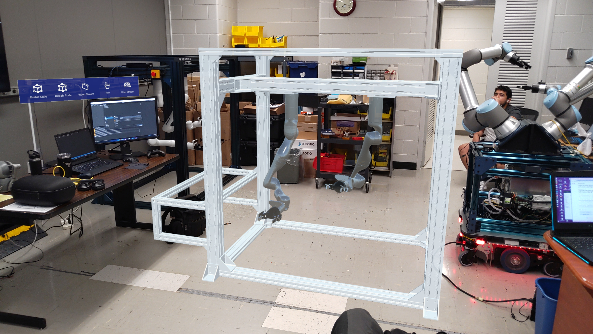
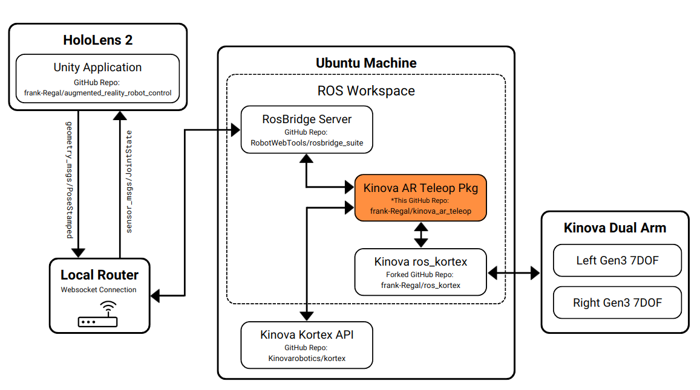

# Kinova Augmented Reality Teleop
### About
ROS package to be used in conjunction with the [Augmented Reality Robot Control HoloLens 2 Application](https://github.com/frank-Regal/augmented_reality_robot_control 'https://github.com/frank-Regal/augmented_reality_robot_control'). This package specifically enables users to control [Kinova Robotics Gen3 7DOF Robotic Arms](https://www.kinovarobotics.com/product/gen3-robots 'https://www.kinovarobotics.com/product/gen3-robots') for both single & dual arm setups using just their hands from a remote location using the HoloLens 2.



###### Figure 1: View of the holographic replica of the Kinova dual arm setup as scene from the HoloLens 2.

### Branches
- ```melodic-devel``` - [ROS Melodic Package](http://wiki.ros.org/melodic 'http://wiki.ros.org/melodic')
- ```kinetic-devel``` - [ROS Kinetic Package](http://wiki.ros.org/kinetic 'http://wiki.ros.org/kinetic')

## Getting Started
This package is meant to be installed on a computer that is on the same local network that both the robotic arms are on and the HoloLens 2 is connected to. This package serves as the middle man decoding and encoding messages to be sent to and from both the HoloLens 2 and the Kinova Robotic arms. For an example setup of how this package has been used within the entire system see the figure below.



### Install Dependencies
1. Ensure you have ROS [Melodic](http://wiki.ros.org/melodic 'http://wiki.ros.org/melodic') installed.
2. Create a catkin workspace and clone the following forked Kinova/ros_kortex repo [Github - frank-Regal/ros_kortex](https://github.com/frank-Regal/ros_kortex 'https://github.com/frank-Regal/ros_kortex') into the workspace.
    - ```git clone https://github.com/frank-Regal/ros_kortex.git```
3. ```cd ros_kortex``` and change to the correct branch to match your ros version. For example ```git checkout melodic-devel```
4. Install the RosBridge Server with ```sudo apt install ros-melodic-rosbridge-suite``` or install from source [rosbridge_suite](https://github.com/RobotWebTools/rosbridge_suite/tree/ros1 'https://github.com/RobotWebTools/rosbridge_suite/tree/ros1')

### Clone Package
1. Navigate to your catkin workspace src/ directory that the ros_kortex package is located in. For example: ```cd ~/catkin_ws/src```
2. Clone this repo ```git clone https://github.com/frank-Regal/kinova_ar_teleop.git```
3. ```cd kinova_ar_teleop``` and change to the correct branch to match your ros version. For example ```git checkout melodic-devel```
4. Build the catkin workspace. For example ```cd ~/catkin_ws``` and ```catkin build```
5. Source your workspace ```source devel/setup.bash```

## Running Tests
This package contains two test launch files and a test publisher node. The test publisher node publishes a fake set of ```geometry_msgs/PoseStamped``` messages that is intended to mimic hand tragectories captured and published from the HoloLens. The test launch files launch all the nodes required to test the robotic arm functionality without actually needed a HoloLens connected and running. It is recommended you follow the following steps first before you try and control the arms with the HoloLens. If you complete these steps correctly you should see the kinova arms moving up and down in the z-direction. You can control just one arm or two arms depending on your current setup.

### Configure and Run
1. Navigate to the launch/ directory of this repo. For example ```cd ~/catkin_ws/src/kinova_ar_teleop/launch```
2. Open either ```one_hand_teleop_test.launch``` for single arm testing or ```two_hand_teleop_test.launch``` for dual are testing.
3. Config the ip address arg at the top of the launch file with the ip address of the kinova arm robot on your network.
    - Leave the naming conventions the same, these should only be touched if you run into namespacing issues.
4. Review the ```params.yaml``` file under the config directory. These paramaters should not need to be touched, just be aware of them.
5. With your workspace sourced and the robotic arms turned on, launch one of the desired test launch files as follows:
    - One arm test: ```roslaunch kinova_ar_teleop one_hand_teleop_test.launch```
    - Two arm test: ```roslaunch kinova_ar_teleop two_hand_teleop_test.launch```
6. You will see five new terminal windows open and the robots should start to dance.

### Shutdown
1. To STOP the test, find the two windows that are publishing the pose stamped messages. They should be scrolling with text that says something similar to "left/controller" or "right/controller". ctrl-c these two windows first, and then you can shut down the other windows.

## Running Package
To control the robotic arms with the HoloLens, this package needs to be running first before you start the HoloLens application. On the Ubuntu Machine this package is cloned to first configured the launch files and then run.

### Configure and Run
1. Navigate to the launch/ directory of this repo. For example ```cd ~/catkin_ws/src/kinova_ar_teleop/launch```
2. For the current HoloLens 2 application [Augmented Reality Robot Control](https://github.com/frank-Regal/augmented_reality_robot_control 'https://github.com/frank-Regal/augmented_reality_robot_control') the application is setup to visualize and control two arms. Therefore you want to use the two hand launch file. Open ```two_hand_teleop.launch``` to configure.
3. Config the ip address arg at the top of the launch file with the ip address of the two kinova arm robots on your network.
    - Leave the naming conventions the same, these should only be touched if you run into namespacing issues.
4. Review the ```params.yaml``` file under the config directory. These paramaters should not need to be touched, just be aware of them.
5. With your workspace sourced and the robotic arms turned on, run the package as follows:
    - ```roslaunch kinova_ar_teleop two_hand_teleop_test.launch```
6. Nothing should happen until you start up the HoloLens application and begin to move the arms.

### Shutdown
1. ctrl-c out of all the terminals that have opened up.

## Contributing
There are two methods within this package to control the robot arms. 

#### Method 1:
The first and default method via the launch files is to call a ROS node called ```teleop_w_twist```. This node subscribes to both the left and right position of the tracked hands in the HoloLens 2 on two seperate geometry_msgs/PoseStamped topics. The node takes these PoseStamped msgs everytime they are received and converts them to kortex_driver/TwistCommand msgs. 

This conversion is done in the hololens_utility.h file. The utility pulls the current cartesian pose of the robots from the ROS service /kinova_arm/base/get_measured_cartesian_pose, compares it to the pose of the hands, divides by a time delta, and then packages it up into a linear and angular x,y,z twist message. This twist message is then published and the ros_kortex package sends it to the onboard Kortex API where all the IK solving happens.

#### Method 2:
The second method is more low-level and calls the Kortex API IK solver on its own. This method is more unstable and should only be used for low-level control if need be. Work on this method is inprogress.


